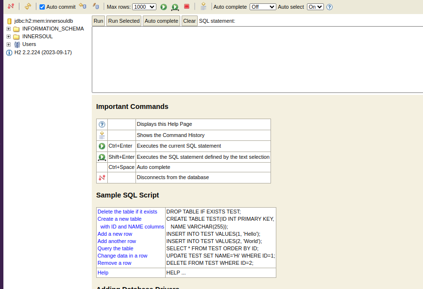

# inner-sould-service
Backend for my project

Database H2
http://localhost:8080/h2-console

You can access the H2 console at http://localhost:8080/h2-console with the following settings:

JDBC URL: jdbc:h2:mem:innersouldb
User Name: sa
Password: (leave blank)

Swagger url
http://localhost:8080/v3/api-docs

http://localhost:8080/swagger-ui/index.html